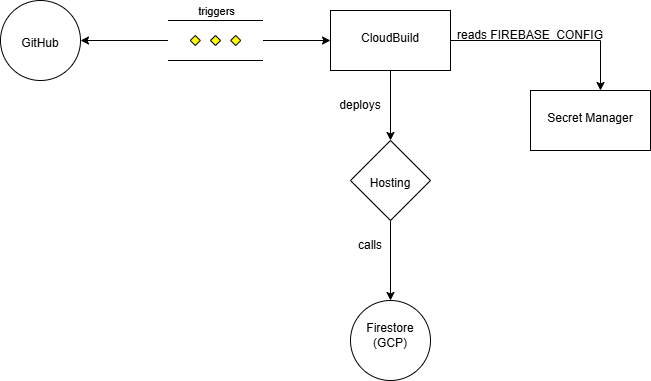

# **ListMe Application**

This is an Ionic/Angular application that allows users to list and book properties. It uses **Firebase Firestore** for data storage and is hosted on **Firebase Hosting**.

This guide displays how to deploy the application locally and further down describes how to deploy it to Google Cloud Platform using Cloud Build.

> **⚠️ EDUCATIONAL PURPOSE:**
> This application is designed **for educational purposes only** to share with learners how to deploy Cloud Native applications to Google Cloud Platform.

---

## **Architecture**

The following diagram illustrates the cloud architecture and deployment pipeline for the ListMe application:



---

## **Features**
- **Ionic/Angular Framework**: Cross-platform mobile/web application structure.
- **Firebase Firestore**: NoSQL cloud database for storing property and booking data.
- **Firebase Hosting**: Fast and secure hosting for the web assets.
- **Automated Deployment**: Uses Google Cloud Build for CI/CD.

---

## **Local Setup**

### **1. Prerequisites**
- **Node.js 20+** installed.
- **Ionic CLI** installed globally (`npm install -g @ionic/cli`).
- **Google Cloud CLI** installed and authenticated.

### **2. Clone the Repository**
```bash
git clone <repository-url>
cd listMe
```

### **3. Install Dependencies**
```bash
npm install
```

### **4. Configure Environment**
For local development, create `src/environments/environment.ts` with your Firebase configuration.

This repository ignores `src/environments/` to prevent committing secrets. For CI/CD, Cloud Build generates the environment files from Secret Manager.

### **5. Run Locally**
```bash
ionic serve
```
Visit `http://localhost:8100`.

---

## **Deployment to Google Cloud**

This guide details how to deploy the "ListMe" app using **Google Cloud Build** and **Firebase**.

### **1. Set Up Google Cloud Project**
1. Create a new project in the [Google Cloud Console](https://console.cloud.google.com/):
   - Click "Select a project" in the top bar.
   - Click "New Project" and follow the prompts.
2. Note your **Project ID** (e.g., `your-project-id`).
3. Set the project ID as the default for the `gcloud` CLI:
   ```bash
   gcloud config set project YOUR_PROJECT_ID
   ```

### **2. Enable Required Services**
Enable the necessary APIs for your project:
```bash
gcloud services enable cloudbuild.googleapis.com
gcloud services enable firebase.googleapis.com
gcloud services enable firestore.googleapis.com
gcloud services enable serviceusage.googleapis.com
gcloud services enable secretmanager.googleapis.com
```

### **3. Initialize Firebase**
1. Link your GCP project to Firebase:
   ```bash
   gcloud firebase projects create --project=YOUR_PROJECT_ID
   ```
   *(Or use the Firebase Console to add the project)*

2. Create the Firestore database:
   ```bash
   gcloud firestore databases create --location=europe-west2
   ```

### **4. Configure Application**

#### 4.1 Update Project Alias
Update `.firebaserc` with your project ID:
```json
{
  "projects": {
    "default": "YOUR_PROJECT_ID"
  }
}
```

### **5. Store Configuration in Secret Manager**

⚠️ **CRITICAL STEP** - Secure Credential Management

To avoid committing sensitive API keys to GitHub, we use **Google Secret Manager**. The `src/environments` directory is ignored by Git, and Cloud Build will generate it dynamically from a secret.

#### 5.1 Prepare the Config Content
Prepare the content of your `environment.prod.ts` file. Replace the placeholders with your actual Firebase configuration values (found in Project Settings > General > Your Apps).

```typescript
export const environment = {
  production: true,
  firebaseConfig: {
    apiKey: "YOUR_REAL_API_KEY",
    authDomain: "YOUR_PROJECT_ID.firebaseapp.com",
    projectId: "YOUR_PROJECT_ID",
    storageBucket: "YOUR_PROJECT_ID.firebasestorage.app",
    messagingSenderId: "YOUR_SENDER_ID",
    appId: "YOUR_APP_ID"
  }
};
```

#### 5.2 Create the FIREBASE_CONFIG Secret
Run the following command to create the secret named `FIREBASE_CONFIG`.

```bash
gcloud secrets create FIREBASE_CONFIG --data-file=[PATH_TO_YOUR_ENVIRONMENT_FILE]
```

### 5.3 Verify the Secret
To verify the secret was created correctly:
```bash
gcloud secrets versions access latest --secret="FIREBASE_CONFIG"
```

---

## **6. Grant Secret Manager Permissions**

Allow the Cloud Build service account to access the `FIREBASE_CONFIG` secret.

### 6.1 Get Project Number
Run the following command to get your Project Number:
```bash
gcloud projects describe $(gcloud config get-value project) --format="value(projectNumber)"
```

### 6.2 Grant Role
Replace `[PROJECT_NUMBER]` with the number obtained in the previous step.

```bash
gcloud secrets add-iam-policy-binding FIREBASE_CONFIG \
    --member="serviceAccount:[PROJECT_NUMBER]@cloudbuild.gserviceaccount.com" \
    --role="roles/secretmanager.secretAccessor"
```

---

## **7. Configure IAM Permissions**

Cloud Build needs specific permissions to deploy to Firebase Hosting. The Cloud Build service account uses the **Project Number** (not the Project ID) in its email address: `[PROJECT_NUMBER]@cloudbuild.gserviceaccount.com`.

### 5.1 Get Your Project Number
You can find your project number in the Google Cloud Console dashboard, or by running:
```bash
gcloud projects describe YOUR_PROJECT_ID --format="value(projectNumber)"
```
*Note: This is a number (e.g., `123456789012`), different from your text-based Project ID.*

### 5.2 Grant the Role
Grant the `Firebase Hosting Admin` role to the Cloud Build service account. Replace `[PROJECT_NUMBER]` and `[PROJECT_ID]` with your actual values.

```bash
gcloud projects add-iam-policy-binding YOUR_PROJECT_ID \
    --member="serviceAccount:[PROJECT_NUMBER]@cloudbuild.gserviceaccount.com" \
    --role="roles/firebasehosting.admin"
```

## **8. Cloud Build Configuration**
The `cloudbuild.yaml` file handles the deployment pipeline:
1. **Install**: Installs npm dependencies.
2. **Fetch Secrets**: Retrieves `FIREBASE_CONFIG` from Secret Manager and creates `src/environments/environment.prod.ts`.
3. **Build**: Builds the Ionic app for production.
4. **Deploy**: Uses `firebase-tools` to deploy to Firebase Hosting.

```yaml
steps:
  # Step 1: Install dependencies
  - name: 'node:20'
    entrypoint: 'npm'
    args: ['install']

  # Step 2: Create environment.prod.ts from Secret Manager
  - name: 'gcr.io/cloud-builders/gcloud'
    entrypoint: 'bash'
    args:
      - '-c'
      - |
        mkdir -p src/environments
        gcloud secrets versions access latest --secret=FIREBASE_CONFIG > src/environments/environment.prod.ts
        cp src/environments/environment.prod.ts src/environments/environment.ts

  # Step 3: Build the application
  - name: 'node:20'
    entrypoint: 'npm'
    args: ['run', 'build']

  # Step 4: Deploy to Firebase Hosting
  - name: 'node:20'
    entrypoint: 'bash'
    args:
      - '-c'
      - |
        npm install -g firebase-tools
        firebase deploy --only hosting --project $PROJECT_ID

options:
  logging: CLOUD_LOGGING_ONLY
timeout: '900s'
```

## **9. Deploy the Application**

The application is deployed automatically using Cloud Build triggers.

### 9.1 Push Code to GitHub
The following instruction shows deployment using Cloud Build triggers.

1. Add a remote repository to your project:
   ```bash
   git remote add origin https://github.com/<YOUR_GITHUB_USERNAME>/<YOUR_REPOSITORY>.git
   ```
2. Push your code to GitHub:
   ```bash
   git add .
   git commit -m "Initial commit"
   git push -u origin main
   ```

### 9.2 Create a Cloud Build Trigger
Set up a trigger in Google Cloud to deploy your app on every commit:
```bash
gcloud beta builds triggers create github \
    --name="deploy-listme" \
    --repo-name="<YOUR_REPOSITORY>" \
    --repo-owner="<YOUR_GITHUB_USERNAME>" \
    --branch-pattern="^main$" \
    --build-config="cloudbuild.yaml" \
    --region=global \
    --service-account="projects/<YOUR_PROJECT_ID>/serviceAccounts/<YOUR_PROJECT_NUMBER>@cloudbuild.gserviceaccount.com"
```

Replace `<YOUR_REPOSITORY>`, `<YOUR_GITHUB_USERNAME>`, `<YOUR_PROJECT_ID>`, and `<YOUR_PROJECT_NUMBER>` with your project details.

To confirm the trigger exists:
```bash
gcloud builds triggers list --region=global
```

> **Note**: The above command requires your GitHub repository to be connected to Cloud Build. If it fails, please connect your repository via the [Google Cloud Console Triggers Page](https://console.cloud.google.com/cloud-build/triggers). It failed for me, so ensure your repo is connected.

---

## **10. GCP Services & Cost Analysis**

### **10.1 GCP Services Used**
| Service | Purpose | Justification |
|---------|---------|---------------|
| **Cloud Build** | CI/CD Pipeline | Native integration with GCP, supports containerized builds, and secure secret access. |
| **Secret Manager** | Security | Securely stores API keys and config, preventing credential leakage in source code. |
| **Firebase Hosting** | Web Hosting | Deployment target for the built SPA (`firebase deploy --only hosting`). Global CDN, SSL by default, and optimized for Ionic/Angular single-page apps. |
| **Cloud Firestore** | Database | NoSQL database perfect for flexible data structures in mobile apps; real-time capabilities. |
| **Google Maps API** | Location Services | Provides map visualization for property listings. |

Overall, this is a **serverless** architecture: the frontend is deployed to managed hosting and it uses managed services (Firestore + Secret Manager) with CI/CD handled by Cloud Build.

### **10.2 Cost Calculation (Monthly Estimate)**
Based on the exported Google Cloud Pricing Calculator estimate (EUR):

| Service | Monthly Estimate (EUR) | Notes |
|---------|-------------------------|-------|
| **Cloud Firestore** | **€20.20896** | 1M Reads (€9.72829) + 200K Writes (€5.52976) + 50GB Storage (€4.95091) (europe-west2). |
| **Firebase Hosting** | **€15.08948** | Pricing Calculator export lists these under **Firebase App Hosting** SKUs (cached/uncached bytes, 10K requests + 2 vCPUs + 8GB memory, 10GB artifact storage). |
| **Cloud Build** | **€0.00259** | Default pool CPU/RAM usage (global). |
| **Secret Manager** | **€0.00** | Access/rotate/storage items estimated at €0 in this export. |
| **Google Maps API** | **€0.00** | Estimated as €0 in this export. |
| **Total** | **€35.30101** | Calculator export total. |

Pricing Calculator URL: https://cloud.google.com/calculator?dl=CjhDaVE1TnpRMk1qVmpaaTAxWXpJeExUUmpNemt0WWpRMk5TMWtNMkU0TWpZeU9EWmhPRGtRQWc9PRokQTc0M0M1MDYtOEE4RC00QjlBLUI2NTMtMEI3NDZEOEQ5RTk1

---

## **11. AI Tools Usage Declaration**

| Tool | Usage Description | Reliance Level |
|------|-------------------|----------------|
| **GitHub Copilot** | Used to generate boilerplate code for `cloudbuild.yaml`, debug TypeScript & build errors in `identity.ts`, and format this documentation. | High |

---

## **12. Test the Application**

1. Visit your application at:
   ```
   https://<YOUR_PROJECT_ID>.web.app
   ```
---

## **13. Cleanup**

To avoid incurring unnecessary costs, clean up the resources:

Delete the project. First display list of projects:
 
   ```bash
   gcloud projects list
   ```
Then delete the project:
   ```bash
   gcloud projects delete <PROJECT_ID>
   ```
Replace `<PROJECT_ID>` with your project ID.

---

## **14. Troubleshooting**

### **Build Fails on "firebase command not found"**
Ensure the Cloud Build step installs `firebase-tools` globally (`npm install -g firebase-tools`) before running deploy commands.

### **Permission Denied during Deployment**
Ensure the Cloud Build service account has the `Firebase Hosting Admin` role.

### **Firestore Connection Issues**
Check that your `environment.prod.ts` has the correct `projectId` and `apiKey`. Ensure Firestore rules allow read/write access (for development/testing).

## **listMe Application**
https://listme-dc189.web.app
## **GitHub Repository** 
https://github.com/MarvelUsoroh/listme